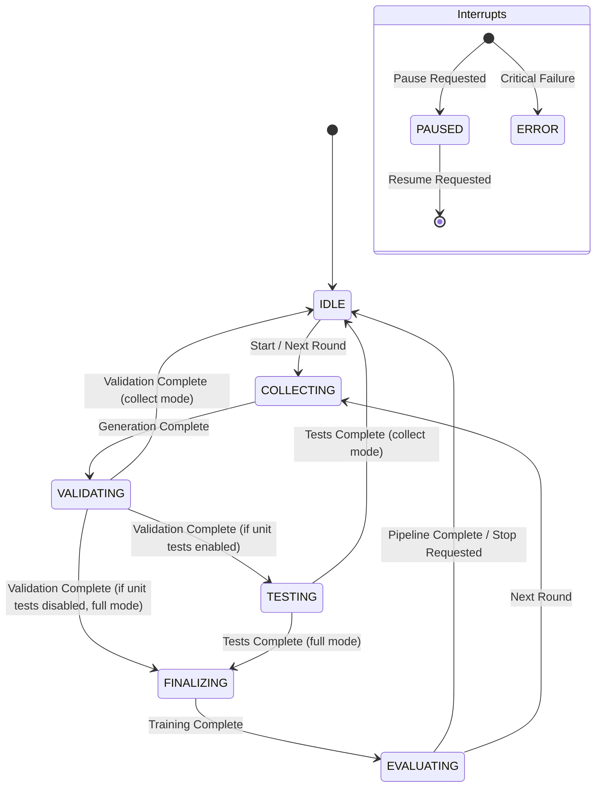

# Heidi Engine Loop Contract

## State Machine Diagram

## State Definitions

| State | Description | Event Emitted |
|-------|-------------|---------------|
| `IDLE` | Pipeline is waiting to start, finished, or explicitly stopped. | `pipeline_start`, `pipeline_complete`, `pipeline_stop` |
| `COLLECTING` | Generating abstract syntax/code samples from the Teacher model. | `stage_start` (generate) / `stage_end` (generate) |
| `VALIDATING` | Validating dataset format, deduplicating, and scrubbing secrets. | `stage_start` (validate) / `stage_end` (validate) |
| `TESTING` | (Optional) Running generated code against unit test runner. | `stage_start` (test) / `stage_end` (test) |
| `FINALIZING` | Training the base model with the verified dataset using QLoRA. | `stage_start` (train) / `stage_end` (train) |
| `EVALUATING` | Evaluating the new adapter weights for format/success metrics. | `stage_start` (eval) / `stage_end` (eval) |
| `PAUSED` | Pipeline execution is temporarily suspended between batches/stages. | N/A |
| `ERROR` | Pipeline encountered an unrecoverable error. | `pipeline_error` |

## Transition Table

| Current State | Condition / Trigger | Next State | Actions |
|---------------|---------------------|------------|---------|
| `IDLE` | Pipeline started or `train-now` triggered | `COLLECTING` | Init telemetry, prep dirs |
| `COLLECTING` | Generation finishes successfully | `VALIDATING` | Write `raw_round_X.jsonl` |
| `VALIDATING` | Validation finishes, `RUN_UNIT_TESTS=1` | `TESTING` | Write `clean_round_X.jsonl` |
| `VALIDATING` | Validation finishes, `PIPELINE_MODE=full` | `FINALIZING` | Skip tests, split train/val |
| `VALIDATING` | Validation finishes, `PIPELINE_MODE=collect` | `IDLE` | Wait for `train-now` latch |
| `TESTING` | Testing finishes, `PIPELINE_MODE=full` | `FINALIZING` | Write `tested_round_X.jsonl` |
| `TESTING` | Testing finishes, `PIPELINE_MODE=collect` | `IDLE` | Wait for `train-now` latch |
| `FINALIZING` | Training finishes | `EVALUATING` | Save adapter to `out_lora` |
| `EVALUATING` | Eval finishes, more rounds remaining | `COLLECTING` | Update `best_adapter` symlink |
| `EVALUATING` | Eval finishes, no rounds remaining | `IDLE` | Exit |

## I/O and Interface Contract

1. **State Persistence**: 
   - State written to `$OUT_DIR/state/run_state.json`.
   - `run_id`, `current_round`, `last_write_ts`, `counts`, `mode` must be identical to Python behavior.
2. **Event Journal Hooks**:
   - The loop must emit telemetry via `heidi_engine.telemetry.emit_event()`.
   - Expected events: `stage_start`, `stage_end`, `progress`, `train_now_trigger`, `train_now_complete`.
3. **Interrupt Handling**:
   - `check_stop_request()` and `check_pause_request()` must be polled at stage boundaries.
   - Fail-closed: invalid samples never reach the verified/train queue.
