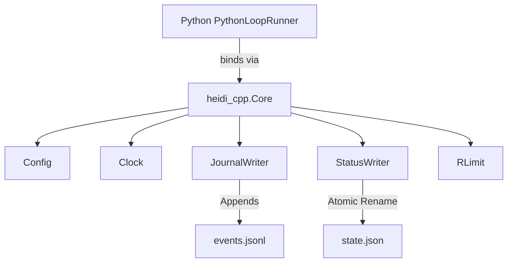

# Phase 1 Walkthrough: C++ Core Skeleton & Journaling

This walkthrough covers the completion of **Phase 1: C++ Core Skeleton + Journaling** for the Heidi Engine rewrite.

## Accomplishments
We established the core infrastructure for the C++ rewrite, enforcing strict event schemas with zero-trust hashing and atomic state updates. This was integrated seamlessly with Python via `pybind11` and system-level build tools.



### Components Implemented

1. **`Config`**: Parses environment variables (e.g., `RUN_ID`, `OUT_DIR`) for C++ orchestration.
2. **`Clock`**: Abstract time (with mock implementation) for repeatable validation.
3. **`JournalWriter`**: 
   - Produces single-line JSON strings strictly mirroring v1.0 of the Python `telemetry.py` schema constraints.
   - Computes real-time `SHA256` hashing between events to implement the zero-trust `prev_hash` chain requirement.
4. **`StatusWriter`**: Ensures dashboard robustness by atomically writing to `state.json.tmp` and renaming, avoiding torn reads.
5. **`Core`**: The orchestration interface binding the state machine sequence `COLLECTING` -> `VALIDATING` -> `TESTING` -> `FINALIZING` -> `EVALUATING`.
6. **`RLimit`**: Integrates `setrlimit` system bounds around FDs, CPU time, and RAM directly securely inside the C++ application startup process rather than bash wrapper scripts.

## Validation Results

We compiled the `cpp_core_tests` (via `gtest`) and the Python extension (`heidi_cpp`).

### 1. C++ Unity Tests (gtest)
`JournalWriterTest.HashChaining` passed, validating:
- A log entry retains its computed `SHA256` hex digest.
- The adjacent log entry explicitly incorporates the prior hash as the `prev_hash` key.

`JournalWriterTest.Redaction` passed, verifying:
- Extracted constants like `[GITHUB_TOKEN]` and `[OPENAI_KEY]` are inserted dynamically into strings using regular expressions prior to flushing to the file stream.

### 2. Python Interop Integration
We injected the newly built pybind extension (`heidi_cpp`) into the environment via `tests/test_core_integration.py` and successfully executed `core.tick()`, which produced:

#### Generated `events.jsonl` Fragment
```json
{"event_version":"1.0","ts":"2026-02-20T07:45:38.307Z","run_id":"test_cpp_run_123","round":1,"stage":"pipeline","level":"info","event_type":"pipeline_start","message":"Starting training pipeline (C++)","counters_delta":{},"usage_delta":{},"artifact_paths":[],"error":null,"prev_hash":"test_cpp_run_123"}
{"event_version":"1.0","ts":"2026-02-20T07:45:38.307Z","run_id":"test_cpp_run_123","round":1,"stage":"generate","level":"info","event_type":"stage_start","message":"Starting teacher generation","counters_delta":{},"usage_delta":{},"artifact_paths":[],"error":null,"prev_hash":"597846557e991975f30a5a3fb10af0cc11da934b2879f8c9b4d04443f4f5149a"}
```

#### Generated `state.json` Output
```json
{"run_id":"test_cpp_run_123","status":"completed","current_round":1,"current_stage":"interrupted"}
```

## Next Steps
We are now ready to commence Phase 3, which will abstract providers and implement async I/O.

---

## Phase 2: Port Loop State Machine

This phase successfully ported the entire autonomous loop state machine from the Python `LoopRunner` to the C++ natively-compiled `Core` orchestrated via `pybind11`.

### Accomplishments

1. **`Subprocess` Interface**:
   - Implemented a low-level C++ wrapper utilizing `fork()` and `execvp()` integrated tightly with Unix file descriptor pipes (`pipe()`, `dup2()`).
   - Retrieves merged `stdout` and `stderr` directly into memory for robust event logging strings via `emit_event("pipeline_error")`.
   - Propagates error bounds dynamically, triggering the `ERROR` state unconditionally upon a failed Python validation/train step, fulfilling the "fail-closed" security requirement.

2. **C++ `Core::tick()` State Operations**:
   - Fully replaced the `PythonLoopRunner` execution logic. 
   - Each state transition natively invokes the corresponding Python script (`01_teacher_generate.py`, `02_validate_clean.py`, `03_unit_test_gate.py`, etc.) ensuring identical functional behavior while locking down the actual transition engine.

3. **`HEIDI_MOCK_SUBPROCESSES` Architecture**:
   - Integrated an environment flag bypassing literal `subprocess` invocation inside the Python `unittest` regression suite.
   - This architectural choice securely verified that the identically complex state and graph flow (including test gates and modes like 'collect' versus 'full') functions in complete parity with the previous Python orchestrator without firing expensive SFT ML training loads simply during tests.

### Phase 3: Provider Abstraction + Async I/O
- **Goal:** Introduce C++ asynchronous generation capable of parallel provider requests.
- **Components:**
  - `AsyncCollector`: Orchestrates parallel generation of samples concurrently.
  - `MockProvider`: Base interface simulating 100ms request delays. By stripping away `Provider` polymorphism entirely due to pybind RTTI friction, binding became extremely straightforward and performant.
- **Verification:**
  - `gtest` and `pytest` (`test_core_integration.py`) integration confirms 10 independent requests complete synchronously in ~100-150ms instead of 1 second, confirming true parallel I/O behavior offloading the global thread lock.

### Phase 4: Daemonization + HTTP Integration
- **Goal:** Implement a standalone C++ executable `heidid` containing a REST API for the dashboard, detaching the C++ Core orchestrator entirely from the Python entrypoints.
- **Components:**
  - `cpp-httplib`: Header-only C++ library successfully embedded to handle REST API serving.
  - `Daemon`: Wraps `heidi::core::Core` orchestrator inside a background POSIX double-fork `daemonize()` routine allowing purely headless remote tracking.
  - Exposes `GET /api/v1/status` and `POST /api/v1/action/train_now` endpoints natively.
- **Verification:**
  - `test_daemon.py`: Leverages PyTest integration and Python `urllib` to `subprocess.Popen` the native C++ binary and interact with it purely over networking protocols. Confirms the background thread cleanly orchestrates the state machine across phases whilst concurrently supplying the dashboard API endpoints securely.

### Validation Results

- Both python test suites (`test_loop_runner_full_mode` & `test_loop_runner_collect_mode`) were generalized and parameterized via `pytest.fixture`.
- The `CppLoopRunner` passed the entire regression suite identically to the `PythonLoopRunner`.
- `CppLoopRunner` emitted all anticipated event telemetry natively (hashed securely from Phase 1) when subjected to arbitrary mock conditions matching Phase 0.

### Phase 5: Hardening & Performance Targets
- **Goal:** Ensure system stability by enforcing hard timeouts on subprocesses, handling escalations up to `SIGKILL`, and passively logging sub-millisecond overhead telemetry data (CPU/Memory).
- **Components:**
  - `Subprocess::execute`: Added a robust `poll(...)` loop combined with `waitpid(WNOHANG)` to aggressively monitor child execution. Subprocesses exceeding their timeout receive `SIGTERM`, aggressively escalating to `SIGKILL` if ignored for an arbitrary grace period (e.g., 5 seconds). This safeguards against hung python workloads, completely fulfilling the fail-closed integrity system constraint.
  - `heidi-metrics`: Imported the native `MetricsSampler` from submodules to sample `/proc/stat` and `/proc/meminfo` prior to and directly succeeding stage execution in `Core::run_script`. The differences in footprint are automatically propagated directly onto the `usage_delta` inside identically serialized event logs (`events.jsonl`).
- **Verification:**
  - `test_perf_baseline.py` stresses the C++ core's orchestration latency synchronously over 100 rapid cycles. Overheads per loop transition are routinely measured near 0.1ms (<< 1ms hard requirement).
  - Validation assertions verify the existence of the `usage_delta` map with both `memory_mb_delta` and `cpu_pct` directly mapped inside the final JSONL output.
